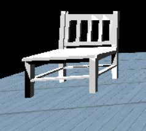

# Graphics Final_Project
## Application Examples in Computer Graphics
## Idea
Make a Dental Clinic and our Robot is the Dentist

* We make the Robot interact with Doctor Chair and Microscope 
* User can change the floor using menu

## Here is our Dental Clinic
* with default floor

    

## We have 3 different options for Clinic Floor (default "Above Photo" / floor1 / floor2)
    
* ### Floor 1

* ### Floor 2

    
    
## We use 6 objects : 
    
* ### Dental patient Chair & Dental Lamp 

    
    
* ### Patient bed
    
    
    
* ### Doctor chair
    
    
    
* ### Table & Microscope
    
    

## Animation
Two of them using the robotic body:
* First : Motion of Robotic Body in the clinic ,See the [Video](https://drive.google.com/file/d/1L-U6tFHz2ay3kEt7oexPzXdaSQJE_jx3/view?usp=sharing) 

    * Sequence of motion
    
    | Motion | Letter | 
    | :----: | :----: | 
    | Move Forward | p |
    | Turn Left | w |
    | Step Forward_X | i | 
    | Backward | P |
* Second : Motion of Robotic Body to Doctor chair ,See the [Video](https://drive.google.com/file/d/1EmJcwwqRYBEjAlZry_5TN5ILy1wuneuE/view?usp=sharing) 
    
    * Sequence of motion
        
        | Motion | Letter | 
        | :----: | :----: | 
        | Move Forward | p |
        | Turn Left | w |
        | Step Forward_X | i | 
        | Sit Down | y |
        | Stand Up | Y |
        | Step Backward_X | I | 
        
The last animation the Robotic Body interact with Microscope ,See the [Video](https://drive.google.com/file/d/1SSyxh1TTu--CbNLkZ_0tJ2g2xvaIGW99/view?usp=sharing) 
* Sequence of motion
        
    | Motion | Letter | 
    | :----: | :----: | 
    | Move Forward | p |
    | Turn Left | w |
    | Step Forward_X | i | 
    | Shoulder Up| n |
    | Interact with Microscope Up| v |
    | Interact with Microscope Down | V | 
    
## Issues that we faced
* To make the motion smooth
* To make Robotic body move together
* To make Lightening work

## About Us :
### Group Id : 07
### Team Members :

| Name | Section | B.N | Seating Number | Email |
| :----: | :----: | :----: |  :----: |  :----: |
| Rawan Sayed | 1 | 30 |53030 | rawansayed2021@gmail.com
| Sara Adel | 1 | 35 |53035 | sarahadel540@gmail.com 
| Sara Mohamed | 1 | 36 |53036 | sara.mohamed277991@gmail.com 
| Omar Abdelzaher | 2 | 11|53056 | omarzaher787@gmail.com

## Submitted To :
### Dr. Ayman Eldeib
### Eng. Ayman Anwar
### Eng. Eslam Adel
